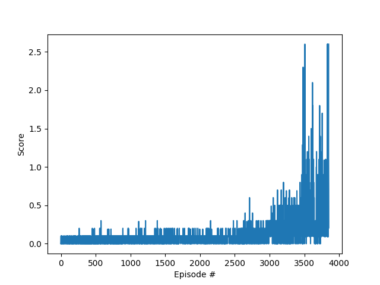

# Results report

## Selected hyperparameters

|Name|Value|
|---|---:|
|Episodes|20000|
|Learning rate|0.0003|
|Gamma|0.99|
|GAE|0.95|
|Frames|256|
|Batch size|64|
|Target|0.5|
|Training epochs|10|
|Epsilon clip|0.1|
|C1|0.5|
|C2|0.01|
|Weight decay|0.00001|


## [Proximal Policy Optimization](https://arxiv.org/abs/1707.06347)

### Actor network

- Tanh linear layer (in: number of states, out: 256)
- Tanh linear layer (in: 256, out: 256)
- Tanh linear layer (in: 256, out: 256)
- Tanh linear layer (in: 256, out: number of actions)

### Critic network

- Tanh linear layer (in: number of states, out: 256)
- Tanh linear layer (in: 256, out: 256)
- Tanh linear layer (in: 256, out: 256)
- Linear layer (in: 256, out: 1)

Rewards per episode:


```
Episode 0       Episode score: 0.00000  Average Score: 0.00000
Episode 100     Episode score: 0.00000  Average Score: 0.01960
Episode 200     Episode score: 0.10000  Average Score: 0.02620
Episode 300     Episode score: 0.10000  Average Score: 0.03860
Episode 400     Episode score: 0.00000  Average Score: 0.04870
Episode 500     Episode score: 0.00000  Average Score: 0.05360
Episode 600     Episode score: 0.10000  Average Score: 0.06740
Episode 700     Episode score: 0.10000  Average Score: 0.06530
Episode 800     Episode score: 0.00000  Average Score: 0.05240
Episode 900     Episode score: 0.10000  Average Score: 0.06130
Episode 1000    Episode score: 0.00000  Average Score: 0.07950
Episode 1100    Episode score: 0.00000  Average Score: 0.06670
Episode 1200    Episode score: 0.20000  Average Score: 0.08250
Episode 1300    Episode score: 0.10000  Average Score: 0.07380
Episode 1400    Episode score: 0.09000  Average Score: 0.07970
Episode 1500    Episode score: 0.10000  Average Score: 0.07410
Episode 1600    Episode score: 0.10000  Average Score: 0.08140
Episode 1700    Episode score: 0.09000  Average Score: 0.07690
Episode 1800    Episode score: 0.10000  Average Score: 0.08780
Episode 1900    Episode score: 0.10000  Average Score: 0.08360
Episode 2000    Episode score: 0.10000  Average Score: 0.09010
Episode 2100    Episode score: 0.09000  Average Score: 0.07360
Episode 2200    Episode score: 0.09000  Average Score: 0.09060
Episode 2300    Episode score: 0.09000  Average Score: 0.08180
Episode 2400    Episode score: 0.09000  Average Score: 0.07880
Episode 2500    Episode score: 0.10000  Average Score: 0.09060
Episode 2600    Episode score: 0.10000  Average Score: 0.08610
Episode 2700    Episode score: 0.09000  Average Score: 0.09520
Episode 2800    Episode score: 0.00000  Average Score: 0.10180
Episode 2900    Episode score: 0.10000  Average Score: 0.11020
Episode 3000    Episode score: 0.19000  Average Score: 0.12740
Episode 3100    Episode score: 0.30000  Average Score: 0.15780
Episode 3200    Episode score: 0.80000  Average Score: 0.19030
Episode 3300    Episode score: 0.20000  Average Score: 0.17260
Episode 3400    Episode score: 0.40000  Average Score: 0.22530
Episode 3500    Episode score: 0.60000  Average Score: 0.34720
Episode 3600    Episode score: 0.20000  Average Score: 0.41480
Episode 3700    Episode score: 0.30000  Average Score: 0.31390
Episode 3800    Episode score: 0.60000  Average Score: 0.39970
Episode 3849    Episode score: 2.60000  Average Score: 0.51530
Environment solved in 3749 episodes!    Average Score: 0.51530
```
